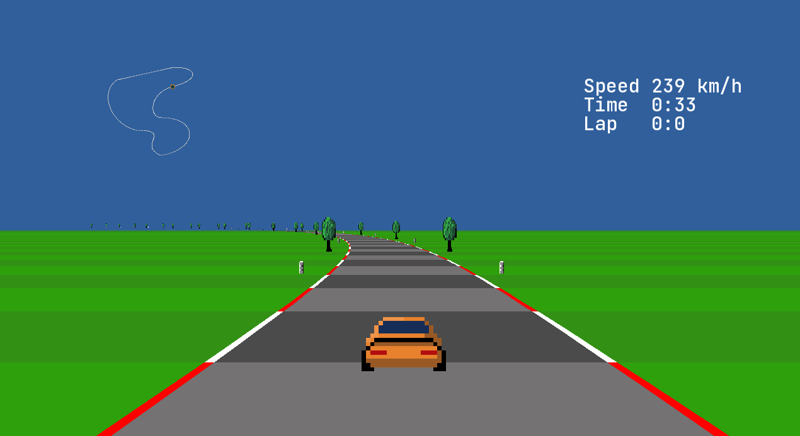

# daLeMans
Simple old-school racing game written in daScript (scripting language created by Gaijin Enternaiment)
Game is not quite complete yet.
Controlled with WSAD.

To run, download the dasbox environment: https://github.com/imp5imp5/dasbox

